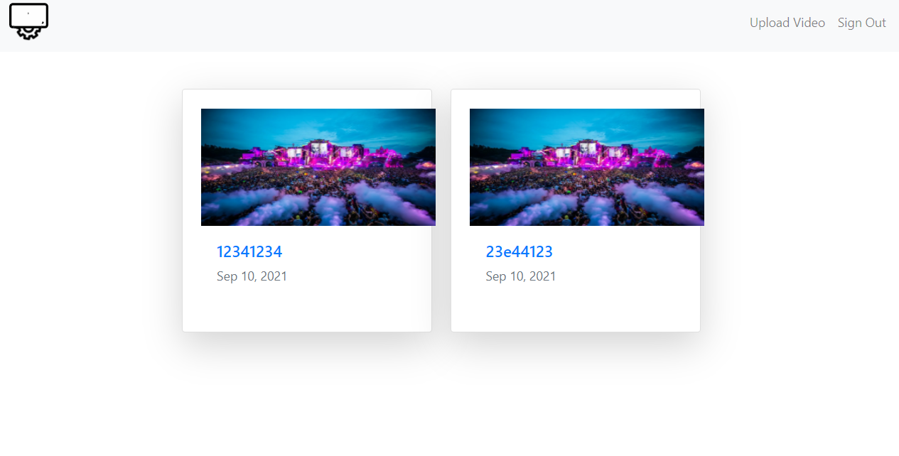

## TUBEIsh 

## Motivation:
Watching videos online is the new thing, so i decide to create an app where you can upload and view tos videos.
## To view the App:
Click [here](https://tubeish.herokuapp.com/).
 ## Trello Board:
 Click [here](https://trello.com/b/9PCGIGNy/videouploader).
## Wire Frame:

## ERD:

## Here's How the Game looks now:

## Technology Used:
- Python.
- Django.
- HTML.
- CSS.
- BootStrap.
- PostgreSQL.
- VideoJs

## Minimum Viable Product:
- AAU, i want to be able to signup, login, and sign out.
- AAU, i want to to be ablke to upload a video.
- AAU, i want to be able to add a thumbnai.
- AAU, i want toi beable toi view other users videos.

IceBox:
- [ ] Add a comment section.
- [ ] Be able to reply to comments.
- [ ] Add  category for each video.
- [ ] Be able to search for videos by category.
- [ ] Be able Who uploaded the video.
- [ ] Add a profile page for the user.